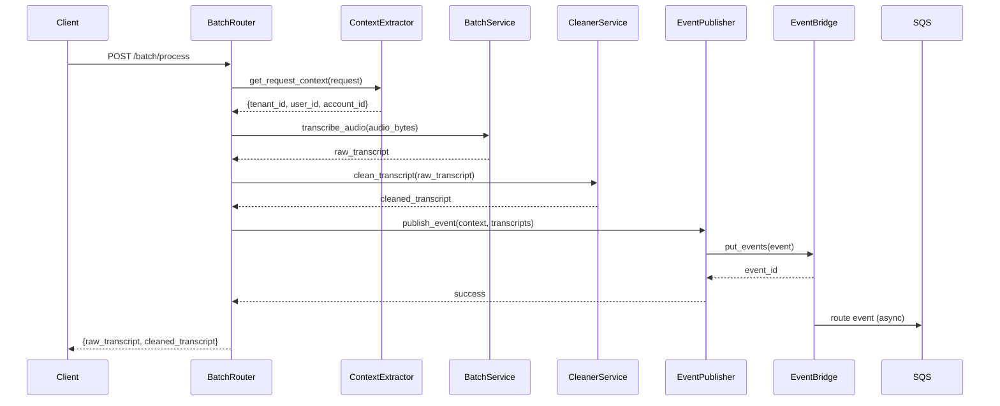

# Design Document: Event-Driven Architecture for Batch Pipeline

## Overview

This design implements an event-driven architecture for the batch audio processing pipeline, enabling asynchronous communication between the transcription service and downstream consumers. The architecture uses Amazon EventBridge as the event bus and Amazon SQS as the message queue, providing reliable, scalable event delivery with built-in retry and dead-letter queue capabilities.

The design introduces three key components:
1. **Context Extraction Layer**: Extracts tenant, user, and account identity from request headers or environment variables
2. **Event Publisher Service**: Publishes structured events to AWS EventBridge
3. **AWS Infrastructure**: SQS queue and EventBridge rule for event routing

**Scope**: This design applies ONLY to the `/batch/process` endpoint. The WebSocket streaming pipeline remains unchanged.

## Architecture

### High-Level Flow

```
┌─────────────┐
│   Client    │
│  (Upload)   │
└──────┬──────┘
       │ POST /batch/process
       │ Headers: X-Tenant-ID, X-User-ID, X-Account-ID
       ▼
┌─────────────────────────────────────────────────────┐
│              Batch Router                           │
│  1. Extract context (get_request_context)           │
│  2. Transcribe audio (BatchService)                 │
│  3. Clean transcript (BatchCleanerService)          │
│  4. Publish event (EventPublisher)                  │
│  5. Return results to client                        │
└──────────────────┬──────────────────────────────────┘
                   │
                   ▼
         ┌─────────────────┐
         │  EventBridge    │
         │  (Event Bus)    │
         └────────┬────────┘
                  │ Event Pattern Match
                  ▼
         ┌─────────────────┐
         │   SQS Queue     │
         │ (Standard)      │
         └────────┬────────┘
                  │
                  ▼
         ┌─────────────────┐
         │  Downstream     │
         │  Consumers      │
         │ (CRM, Analytics)│
         └─────────────────┘
```

### Component Interaction




## Components and Interfaces

### 1. Context Extraction Layer

**Purpose**: Extract tenant, user, and account identity from request headers with fallback to environment variables.

**Location**: `utils/context_utils.py`

**Function Signature**:
```python
from fastapi import Request
from typing import Optional
from dataclasses import dataclass
import uuid

@dataclass
class RequestContext:
    """Context information extracted from request headers and environment."""
    tenant_id: str  # UUID v4
    user_id: str
    account_id: Optional[str]
    interaction_id: str  # UUID v4

def get_request_context(request: Request) -> RequestContext:
    """
    Extract context from request headers with fallback to environment variables.
    
    Priority order:
    1. Request headers (X-Tenant-ID, X-User-ID, X-Account-ID)
    2. Environment variables (MOCK_TENANT_ID, MOCK_USER_ID)
    3. Generated/default values
    
    Args:
        request: FastAPI Request object
        
    Returns:
        RequestContext with all identity fields populated
        
    Raises:
        None - always returns valid context with fallbacks
    """
    pass
```

**Implementation Details**:

1. **Tenant ID Extraction**:
   - Read `X-Tenant-ID` header
   - If not present, read `MOCK_TENANT_ID` environment variable
   - If neither present, generate new UUID v4
   - Validate UUID format, regenerate if invalid

2. **User ID Extraction**:
   - Read `X-User-ID` header
   - If not present, read `MOCK_USER_ID` environment variable
   - If neither present, use "system" as default

3. **Account ID Extraction**:
   - Read `X-Account-ID` header
   - If not present, set to None

4. **Interaction ID Generation**:
   - Always generate new UUID v4 for each request

**Error Handling**:
- Invalid UUID format: Log warning, generate new UUID
- Missing headers: Use fallback chain silently
- All operations are non-blocking and always return valid context


### 2. Event Publisher Service

**Purpose**: Publish structured events to AWS EventBridge with proper error handling and logging.

**Location**: `services/aws_event_publisher.py`

**Class Definition**:
```python
import boto3
import logging
import os
from datetime import datetime
from typing import Dict, Any, Optional

logger = logging.getLogger(__name__)

class AWSEventPublisher:
    """
    Service for publishing events to AWS EventBridge.
    
    Handles event construction, validation, and publishing with
    comprehensive error handling and logging.
    """
    
    def __init__(self):
        """
        Initialize EventBridge client with configuration from environment.
        
        Environment Variables:
            AWS_REGION: AWS region (default: us-east-1)
            AWS_ACCESS_KEY_ID: AWS access key (optional if using IAM)
            AWS_SECRET_ACCESS_KEY: AWS secret key (optional if using IAM)
            EVENTBRIDGE_BUS_NAME: Event bus name (default: default)
            EVENT_SOURCE: Event source identifier (default: com.yourapp.transcription)
        """
        self.region = os.getenv("AWS_REGION", "us-east-1")
        self.bus_name = os.getenv("EVENTBRIDGE_BUS_NAME", "default")
        self.event_source = os.getenv("EVENT_SOURCE", "com.yourapp.transcription")
        
        # Initialize boto3 client
        self.client = boto3.client("events", region_name=self.region)
        
        logger.info(
            f"EventPublisher initialized: region={self.region}, "
            f"bus={self.bus_name}, source={self.event_source}"
        )
    
    def publish_batch_completed_event(
        self,
        interaction_id: str,
        tenant_id: str,
        user_id: str,
        account_id: Optional[str],
        raw_transcript: str,
        cleaned_transcript: str
    ) -> str:
        """
        Publish a BatchProcessingCompleted event to EventBridge.
        
        Args:
            interaction_id: Unique identifier for this processing request
            tenant_id: Tenant/organization identifier
            user_id: User identifier
            account_id: Optional account identifier
            raw_transcript: Original transcript from Deepgram
            cleaned_transcript: Cleaned transcript from CleanerService
            
        Returns:
            Event ID from EventBridge
            
        Raises:
            Exception: If event publishing fails
        """
        pass
```

**Event Structure**:
```python
{
    "version": "1.0",
    "interaction_id": "550e8400-e29b-41d4-a716-446655440000",
    "tenant_id": "660e8400-e29b-41d4-a716-446655440000",
    "user_id": "user@example.com",
    "account_id": "acc_12345",  # or null
    "timestamp": "2024-12-19T10:30:00.000Z",
    "status": "completed",
    "data": {
        "cleaned_transcript": "This is the cleaned transcript...",
        "raw_transcript": "This is the raw transcript..."
    }
}
```

**EventBridge Entry Format**:
```python
{
    "Source": "com.yourapp.transcription",
    "DetailType": "BatchProcessingCompleted",
    "Detail": json.dumps(event_detail),
    "EventBusName": "default"
}
```

**Error Handling**:
- AWS credential errors: Log error, raise exception
- Network errors: Log error with retry suggestion, raise exception
- Invalid event structure: Log error with validation details, raise exception
- All errors include interaction_id for correlation

**Logging**:
- Success: Log event_id and interaction_id at INFO level
- Failure: Log full error with stack trace at ERROR level
- Never log full transcript content (use length instead)


### 3. Batch Router Integration

**Purpose**: Integrate event publishing into the existing batch processing flow.

**Location**: `routers/batch.py`

**Integration Point**:
```python
@router.post("/process")
async def process_batch_audio(file: UploadFile, request: Request):
    """
    Process uploaded audio file and publish completion event.
    
    Flow:
    1. Extract request context (tenant_id, user_id, account_id)
    2. Validate and transcribe audio
    3. Clean transcript
    4. Publish event to EventBridge
    5. Return results to client
    
    Note: Event publishing failure does NOT prevent returning results.
    """
    # Extract context
    from utils.context_utils import get_request_context
    context = get_request_context(request)
    
    logger.info(
        f"Batch processing started: interaction_id={context.interaction_id}, "
        f"tenant_id={context.tenant_id}, user_id={context.user_id}"
    )
    
    # ... existing validation and transcription code ...
    
    # After cleaning completes:
    try:
        from services.aws_event_publisher import AWSEventPublisher
        publisher = AWSEventPublisher()
        
        event_id = publisher.publish_batch_completed_event(
            interaction_id=context.interaction_id,
            tenant_id=context.tenant_id,
            user_id=context.user_id,
            account_id=context.account_id,
            raw_transcript=raw_transcript,
            cleaned_transcript=cleaned_transcript
        )
        
        logger.info(
            f"Event published: interaction_id={context.interaction_id}, "
            f"event_id={event_id}"
        )
    except Exception as e:
        # Log error but don't fail the request
        logger.error(
            f"Event publishing failed: interaction_id={context.interaction_id}, "
            f"error={str(e)}",
            exc_info=True
        )
    
    # Always return results
    return {
        "raw_transcript": raw_transcript,
        "cleaned_transcript": cleaned_transcript
    }
```

**Key Design Decisions**:
1. Event publishing happens AFTER cleaning completes
2. Event publishing failure does NOT prevent returning results to client
3. Context extraction happens at the start of request processing
4. All operations are logged with interaction_id for traceability


## Data Models

### RequestContext

```python
from dataclasses import dataclass
from typing import Optional

@dataclass
class RequestContext:
    """
    Context information extracted from request headers and environment.
    
    Attributes:
        tenant_id: UUID v4 identifying the tenant/organization
        user_id: String identifying the user
        account_id: Optional string for additional account context
        interaction_id: UUID v4 uniquely identifying this request
    """
    tenant_id: str
    user_id: str
    account_id: Optional[str]
    interaction_id: str
```

### BatchProcessingCompletedEvent

```python
from typing import Optional
from pydantic import BaseModel, Field

class EventData(BaseModel):
    """Nested data object containing transcript content."""
    cleaned_transcript: str = Field(..., description="Cleaned transcript from CleanerService")
    raw_transcript: str = Field(..., description="Raw transcript from Deepgram")

class BatchProcessingCompletedEvent(BaseModel):
    """
    Event schema for batch processing completion.
    
    This schema is versioned to support future evolution.
    Version 1.0 includes basic transcript data.
    """
    version: str = Field(default="1.0", description="Event schema version")
    interaction_id: str = Field(..., description="UUID v4 identifying this processing request")
    tenant_id: str = Field(..., description="UUID v4 identifying the tenant")
    user_id: str = Field(..., description="User identifier")
    account_id: Optional[str] = Field(None, description="Optional account identifier")
    timestamp: str = Field(..., description="ISO 8601 timestamp")
    status: str = Field(default="completed", description="Processing status")
    data: EventData = Field(..., description="Transcript data")
```

### AWS Resource Models

```python
from typing import Dict, Any

class SQSQueueConfig:
    """Configuration for SQS queue creation."""
    queue_name: str = "meeting-transcripts-queue"
    dlq_name: str = "meeting-transcripts-dlq"
    visibility_timeout: int = 30  # seconds
    message_retention: int = 1209600  # 14 days in seconds
    max_receive_count: int = 3  # before moving to DLQ

class EventBridgeRuleConfig:
    """Configuration for EventBridge rule creation."""
    rule_name: str = "capture-transcripts-rule"
    event_pattern: Dict[str, Any] = {
        "source": ["com.yourapp.transcription"],
        "detail-type": ["BatchProcessingCompleted"]
    }
    state: str = "ENABLED"
```


## AWS Infrastructure Design

### SQS Queue Architecture

**Main Queue**: `meeting-transcripts-queue`
- Type: Standard Queue (high throughput, at-least-once delivery)
- Visibility Timeout: 30 seconds
- Message Retention: 14 days
- Max Message Size: 256 KB (default)
- Receive Message Wait Time: 0 seconds (short polling)

**Dead Letter Queue**: `meeting-transcripts-dlq`
- Type: Standard Queue
- Message Retention: 14 days
- Purpose: Store messages that fail processing after 3 attempts

**Queue Policy**:
```json
{
  "Version": "2012-10-17",
  "Statement": [
    {
      "Effect": "Allow",
      "Principal": {
        "Service": "events.amazonaws.com"
      },
      "Action": "sqs:SendMessage",
      "Resource": "arn:aws:sqs:us-east-1:ACCOUNT_ID:meeting-transcripts-queue",
      "Condition": {
        "ArnEquals": {
          "aws:SourceArn": "arn:aws:events:us-east-1:ACCOUNT_ID:rule/capture-transcripts-rule"
        }
      }
    }
  ]
}
```

### EventBridge Rule Configuration

**Rule Name**: `capture-transcripts-rule`

**Event Pattern**:
```json
{
  "source": ["com.yourapp.transcription"],
  "detail-type": ["BatchProcessingCompleted"]
}
```

**Target Configuration**:
- Target: SQS Queue ARN
- Input: Full event (no transformation)
- Retry Policy: Default (185 retries over 24 hours)
- Dead Letter Queue: Not configured (SQS has its own DLQ)

### Infrastructure Provisioning Script

**Location**: `scripts/setup_aws_infra.py`

**Purpose**: Idempotently provision all AWS resources required for event-driven architecture.

**Script Structure**:
```python
import boto3
import json
import logging
from typing import Dict, Any

logger = logging.getLogger(__name__)

class AWSInfrastructureProvisioner:
    """
    Provisions AWS infrastructure for event-driven architecture.
    
    Creates:
    1. Dead Letter Queue (DLQ)
    2. Main SQS Queue with DLQ configuration
    3. EventBridge Rule with event pattern
    4. SQS Queue as target for EventBridge Rule
    
    All operations are idempotent - safe to run multiple times.
    """
    
    def __init__(self, region: str = "us-east-1"):
        self.region = region
        self.sqs_client = boto3.client("sqs", region_name=region)
        self.events_client = boto3.client("events", region_name=region)
        self.account_id = boto3.client("sts").get_caller_identity()["Account"]
        
    def create_dlq(self) -> str:
        """Create Dead Letter Queue. Returns queue URL."""
        pass
    
    def create_main_queue(self, dlq_arn: str) -> str:
        """Create main queue with DLQ configuration. Returns queue URL."""
        pass
    
    def create_eventbridge_rule(self) -> str:
        """Create EventBridge rule. Returns rule ARN."""
        pass
    
    def add_queue_target(self, rule_name: str, queue_arn: str):
        """Add SQS queue as target to EventBridge rule."""
        pass
    
    def provision_all(self) -> Dict[str, str]:
        """
        Provision all infrastructure components.
        
        Returns:
            Dictionary with queue URLs and rule ARN
        """
        pass
```

**Idempotency Strategy**:
1. Check if resource exists before creating
2. If exists, log warning and skip creation
3. If creation fails with "AlreadyExists" error, treat as success
4. Return resource identifiers regardless of whether created or existed

**Error Handling**:
- AWS credential errors: Fail fast with clear error message
- Permission errors: Log specific missing permissions
- Network errors: Retry with exponential backoff (3 attempts)
- Resource conflicts: Log and continue


### Verification Script

**Location**: `scripts/verify_event_flow.py`

**Purpose**: Verify that events flow correctly from EventBridge to SQS.

**Script Structure**:
```python
import boto3
import json
import time
import uuid
from datetime import datetime

class EventFlowVerifier:
    """
    Verifies event flow from EventBridge to SQS.
    
    Process:
    1. Publish test event to EventBridge
    2. Poll SQS queue for up to 30 seconds
    3. Verify test event arrives with correct structure
    4. Clean up test message
    """
    
    def __init__(self, region: str = "us-east-1"):
        self.region = region
        self.events_client = boto3.client("events", region_name=region)
        self.sqs_client = boto3.client("sqs", region_name=region)
        
    def publish_test_event(self) -> str:
        """
        Publish test event to EventBridge.
        
        Returns:
            Test interaction_id for verification
        """
        test_id = str(uuid.uuid4())
        
        event = {
            "version": "1.0",
            "interaction_id": test_id,
            "tenant_id": str(uuid.uuid4()),
            "user_id": "test-user",
            "account_id": None,
            "timestamp": datetime.utcnow().isoformat() + "Z",
            "status": "completed",
            "data": {
                "cleaned_transcript": "Test cleaned transcript",
                "raw_transcript": "Test raw transcript"
            }
        }
        
        response = self.events_client.put_events(
            Entries=[{
                "Source": "com.yourapp.transcription",
                "DetailType": "BatchProcessingCompleted",
                "Detail": json.dumps(event),
                "EventBusName": "default"
            }]
        )
        
        return test_id
    
    def poll_queue(self, queue_url: str, test_id: str, timeout: int = 30) -> bool:
        """
        Poll SQS queue for test event.
        
        Args:
            queue_url: SQS queue URL
            test_id: Test interaction_id to look for
            timeout: Maximum seconds to poll
            
        Returns:
            True if test event found, False otherwise
        """
        pass
    
    def verify(self, queue_url: str) -> bool:
        """
        Run full verification flow.
        
        Returns:
            True if verification succeeds, False otherwise
        """
        pass
```

**Verification Steps**:
1. Publish test event with unique interaction_id
2. Poll queue every 2 seconds for up to 30 seconds
3. Parse EventBridge envelope from SQS message
4. Extract event detail and verify interaction_id matches
5. Delete test message from queue
6. Return success/failure

**Exit Codes**:
- 0: Verification succeeded
- 1: Test event not received within timeout
- 2: AWS credential error
- 3: Queue not found
- 4: Event structure validation failed


## Correctness Properties

*A property is a characteristic or behavior that should hold true across all valid executions of a system-essentially, a formal statement about what the system should do. Properties serve as the bridge between human-readable specifications and machine-verifiable correctness guarantees.*

### Property 1: Event Schema Completeness

*For any* event published by the EventPublisher, the event detail should contain all required fields (version, interaction_id, tenant_id, user_id, account_id, timestamp, status, data) with correct types (UUID v4 for IDs, ISO 8601 for timestamp, nested object for data).

**Validates: Requirements 1.1, 1.2, 1.3, 1.4, 1.5, 1.6, 1.7, 1.8**

### Property 2: Context Extraction Fallback Chain

*For any* combination of request headers and environment variables, the context extraction should follow the correct fallback chain: headers → environment variables → defaults, and always return a valid RequestContext with non-null tenant_id and user_id.

**Validates: Requirements 2.1, 2.2, 2.3, 2.4, 2.5, 2.6, 2.7, 2.8, 2.9, 2.10, 2.11**

### Property 3: Event Publishing Resilience

*For any* batch processing request, if event publishing fails (AWS error, network error, etc.), the endpoint should still return the transcription results to the client with HTTP 200 status.

**Validates: Requirements 10.1, 10.2, 10.3, 10.4, 10.5**

### Property 4: Configuration Defaults

*For any* missing environment variable (AWS_REGION, EVENTBRIDGE_BUS_NAME, EVENT_SOURCE), the system should use the documented default value and log the configuration at startup.

**Validates: Requirements 11.1, 11.4, 11.5**

### Property 5: Event Publisher Logging

*For any* event publishing operation (success or failure), the system should log the interaction_id, operation result, and timestamp, but never log the full transcript content (only length).

**Validates: Requirements 12.1, 12.2, 12.3, 12.8**

### Property 6: Infrastructure Provisioning Idempotency

*For any* AWS infrastructure provisioning script execution, running the script multiple times should produce the same result (all resources exist) without errors, regardless of whether resources already existed.

**Validates: Requirements 7.6**

### Property 7: Event Flow End-to-End

*For any* test event published to EventBridge with the correct source and detail-type, the event should appear in the SQS queue within 30 seconds with the same interaction_id and event structure.

**Validates: Requirements 8.1, 8.2, 8.3, 8.4, 8.5, 8.6**


## Error Handling

### Event Publishing Failures

**Scenario**: EventBridge API call fails (credentials invalid, network error, throttling)

**Handling**:
1. Log error with full context (interaction_id, error type, stack trace)
2. Do NOT raise exception to batch router
3. Return normally so client receives transcription results
4. Set up CloudWatch alarms for event publishing failure rate

**Example**:
```python
try:
    event_id = publisher.publish_batch_completed_event(...)
    logger.info(f"Event published: event_id={event_id}")
except Exception as e:
    logger.error(
        f"Event publishing failed: interaction_id={interaction_id}, "
        f"error={type(e).__name__}: {str(e)}",
        exc_info=True
    )
    # Continue - don't fail the request
```

### Missing AWS Credentials

**Scenario**: AWS credentials not configured (no env vars, no IAM role)

**Handling**:
1. Log warning at application startup
2. Disable event publishing feature
3. Log warning for each batch request that event publishing is disabled
4. Continue processing requests normally

**Example**:
```python
try:
    self.client = boto3.client("events", region_name=self.region)
except Exception as e:
    logger.warning(
        f"Failed to initialize EventBridge client: {e}. "
        "Event publishing will be disabled."
    )
    self.client = None
```

### Invalid Context Extraction

**Scenario**: Headers contain invalid UUID format for tenant_id

**Handling**:
1. Log warning with invalid value
2. Generate new valid UUID v4
3. Continue processing with generated UUID
4. Include warning in response headers (X-Warning)

**Example**:
```python
try:
    uuid.UUID(tenant_id, version=4)
except ValueError:
    logger.warning(
        f"Invalid tenant_id format: {tenant_id}. "
        f"Generating new UUID."
    )
    tenant_id = str(uuid.uuid4())
```

### SQS Queue Full or Unavailable

**Scenario**: SQS queue reaches message limit or is temporarily unavailable

**Handling**:
1. EventBridge handles retries automatically (185 retries over 24 hours)
2. After max retries, EventBridge drops the event (no DLQ configured at EventBridge level)
3. SQS DLQ captures messages that fail consumer processing (not delivery failures)
4. Monitor EventBridge FailedInvocations metric

### Infrastructure Provisioning Failures

**Scenario**: AWS resource creation fails (permissions, quota limits, conflicts)

**Handling**:
1. Log specific error with resource name and operation
2. If resource already exists, treat as success
3. If permission error, log required IAM permissions
4. If quota error, log current limits and suggest increase
5. Exit with non-zero code and clear error message


## Testing Strategy

### Unit Testing

**Framework**: pytest with pytest-asyncio for async tests

**Test Coverage**:

1. **Context Extraction Tests** (`tests/unit/test_context_utils.py`):
   - Test header extraction with all headers present
   - Test fallback to environment variables
   - Test fallback to defaults
   - Test invalid UUID format handling
   - Test missing headers and env vars

2. **Event Publisher Tests** (`tests/unit/test_aws_event_publisher.py`):
   - Mock boto3 EventBridge client
   - Test event structure construction
   - Test successful event publishing
   - Test AWS API error handling
   - Test credential error handling
   - Test logging behavior

3. **Batch Router Integration Tests** (`tests/unit/test_batch_router_events.py`):
   - Mock EventPublisher
   - Test event publishing after cleaning
   - Test resilience to publishing failures
   - Test context extraction integration
   - Test response format unchanged

**Mocking Strategy**:
```python
from unittest.mock import Mock, patch
import pytest

@pytest.fixture
def mock_events_client():
    """Mock boto3 EventBridge client."""
    client = Mock()
    client.put_events.return_value = {
        "Entries": [{"EventId": "test-event-id"}],
        "FailedEntryCount": 0
    }
    return client

@pytest.fixture
def mock_event_publisher(mock_events_client):
    """Mock EventPublisher with mocked boto3 client."""
    with patch("boto3.client", return_value=mock_events_client):
        from services.aws_event_publisher import AWSEventPublisher
        publisher = AWSEventPublisher()
        yield publisher
```

### Property-Based Testing

**Framework**: Hypothesis for Python

**Property Tests**:

1. **Property 1: Event Schema Completeness** (`tests/property/test_event_schema.py`):
   - Generate random valid events
   - Verify all required fields present
   - Verify correct types (UUID v4, ISO 8601, etc.)
   - Run 100+ iterations

2. **Property 2: Context Extraction Fallback** (`tests/property/test_context_extraction.py`):
   - Generate random combinations of headers/env vars
   - Verify fallback chain always produces valid context
   - Verify tenant_id is always valid UUID v4
   - Run 100+ iterations

3. **Property 3: Event Publishing Resilience** (`tests/property/test_publishing_resilience.py`):
   - Generate random AWS errors
   - Verify endpoint always returns 200
   - Verify transcripts always returned
   - Run 100+ iterations

**Example Property Test**:
```python
from hypothesis import given, strategies as st
import uuid

@given(
    tenant_header=st.one_of(st.none(), st.uuids(version=4).map(str)),
    user_header=st.one_of(st.none(), st.text(min_size=1)),
    account_header=st.one_of(st.none(), st.text(min_size=1))
)
def test_context_extraction_always_valid(tenant_header, user_header, account_header):
    """
    Property: Context extraction always returns valid context.
    
    Feature: event-driven-architecture, Property 2: Context Extraction Fallback Chain
    """
    # Create mock request with headers
    request = create_mock_request(
        tenant_id=tenant_header,
        user_id=user_header,
        account_id=account_header
    )
    
    # Extract context
    context = get_request_context(request)
    
    # Verify always valid
    assert context.tenant_id is not None
    assert context.user_id is not None
    assert uuid.UUID(context.tenant_id, version=4)  # Valid UUID v4
    assert uuid.UUID(context.interaction_id, version=4)  # Valid UUID v4
```

### Integration Testing

**Framework**: pytest with actual AWS resources or localstack

**Integration Tests**:

1. **Infrastructure Provisioning** (`tests/integration/test_infrastructure.py`):
   - Run setup script against localstack
   - Verify all resources created
   - Run setup script again (idempotency test)
   - Verify no errors on second run

2. **Event Flow End-to-End** (`tests/integration/test_event_flow.py`):
   - Publish test event to EventBridge
   - Poll SQS queue for event
   - Verify event structure matches schema
   - Clean up test message

3. **Batch Endpoint with Events** (`tests/integration/test_batch_with_events.py`):
   - Upload test audio file
   - Verify transcription returned
   - Verify event published to EventBridge
   - Verify event appears in SQS queue

**Localstack Configuration**:
```yaml
# docker-compose.yml for localstack
version: '3.8'
services:
  localstack:
    image: localstack/localstack:latest
    ports:
      - "4566:4566"
    environment:
      - SERVICES=sqs,events
      - DEBUG=1
    volumes:
      - "./localstack:/tmp/localstack"
```

### Test Execution

**Unit Tests**:
```bash
pytest tests/unit/ -v --cov=services --cov=utils --cov-report=html
```

**Property Tests**:
```bash
pytest tests/property/ -v --hypothesis-show-statistics
```

**Integration Tests**:
```bash
# Start localstack
docker-compose up -d

# Run integration tests
pytest tests/integration/ -v

# Cleanup
docker-compose down
```

**Coverage Requirements**:
- Unit tests: 80% minimum coverage
- Property tests: All correctness properties implemented
- Integration tests: Critical paths verified


## Deployment and Configuration

### Environment Variables

**Required for Event Publishing**:
```bash
# AWS Credentials (required for Railway deployment)
AWS_ACCESS_KEY_ID=your_access_key_here
AWS_SECRET_ACCESS_KEY=your_secret_key_here
AWS_REGION=us-east-1

# EventBridge Configuration (optional, defaults shown)
EVENTBRIDGE_BUS_NAME=default
EVENT_SOURCE=com.yourapp.transcription

# Multi-Tenancy Configuration (optional, defaults shown)
MOCK_TENANT_ID=00000000-0000-4000-8000-000000000000
MOCK_USER_ID=system
```

**Update .env.example**:
```bash
# Existing variables...
DEEPGRAM_API_KEY=your_deepgram_api_key_here
REDIS_URL=redis://localhost:6379
OPENAI_API_KEY=your_openai_api_key_here
OPENAI_MODEL=gpt-4o

# New AWS variables
AWS_ACCESS_KEY_ID=your_aws_access_key_here
AWS_SECRET_ACCESS_KEY=your_aws_secret_key_here
AWS_REGION=us-east-1
EVENTBRIDGE_BUS_NAME=default
EVENT_SOURCE=com.yourapp.transcription

# Multi-tenancy
MOCK_TENANT_ID=00000000-0000-4000-8000-000000000000
MOCK_USER_ID=system
```

### Railway Deployment

**Configuration Steps**:

1. **Add Environment Variables** in Railway dashboard:
   - AWS_ACCESS_KEY_ID
   - AWS_SECRET_ACCESS_KEY
   - AWS_REGION
   - MOCK_TENANT_ID
   - MOCK_USER_ID

2. **IAM Permissions Required**:
   ```json
   {
     "Version": "2012-10-17",
     "Statement": [
       {
         "Effect": "Allow",
         "Action": [
           "events:PutEvents"
         ],
         "Resource": "arn:aws:events:*:*:event-bus/default"
       }
     ]
   }
   ```

3. **Deploy to Railway**:
   - Merge to main branch
   - Railway auto-deploys
   - Verify deployment using Railway MCP

### Infrastructure Setup

**One-Time Setup** (run locally or in CI/CD):

```bash
# Install dependencies
pip install boto3

# Configure AWS credentials
export AWS_ACCESS_KEY_ID=your_key
export AWS_SECRET_ACCESS_KEY=your_secret
export AWS_REGION=us-east-1

# Run infrastructure setup
python scripts/setup_aws_infra.py

# Verify event flow
python scripts/verify_event_flow.py
```

**Expected Output**:
```
[INFO] Creating Dead Letter Queue: meeting-transcripts-dlq
[INFO] DLQ created: https://sqs.us-east-1.amazonaws.com/123456789/meeting-transcripts-dlq
[INFO] Creating main queue: meeting-transcripts-queue
[INFO] Main queue created: https://sqs.us-east-1.amazonaws.com/123456789/meeting-transcripts-queue
[INFO] Creating EventBridge rule: capture-transcripts-rule
[INFO] Rule created: arn:aws:events:us-east-1:123456789:rule/capture-transcripts-rule
[INFO] Adding SQS target to rule
[INFO] Target added successfully
[INFO] Infrastructure provisioning complete!

Queue URL: https://sqs.us-east-1.amazonaws.com/123456789/meeting-transcripts-queue
DLQ URL: https://sqs.us-east-1.amazonaws.com/123456789/meeting-transcripts-dlq
Rule ARN: arn:aws:events:us-east-1:123456789:rule/capture-transcripts-rule
```

### Monitoring and Observability

**CloudWatch Metrics to Monitor**:

1. **EventBridge Metrics**:
   - `Invocations`: Number of events published
   - `FailedInvocations`: Number of failed event deliveries
   - `TriggeredRules`: Number of times rule matched

2. **SQS Metrics**:
   - `NumberOfMessagesSent`: Messages delivered to queue
   - `NumberOfMessagesReceived`: Messages consumed
   - `ApproximateAgeOfOldestMessage`: Queue backlog indicator
   - `NumberOfMessagesInDLQ`: Failed message count

**CloudWatch Alarms**:

```python
# Example alarm for failed event publishing
{
  "AlarmName": "EventPublishingFailures",
  "MetricName": "FailedInvocations",
  "Namespace": "AWS/Events",
  "Statistic": "Sum",
  "Period": 300,
  "EvaluationPeriods": 1,
  "Threshold": 10,
  "ComparisonOperator": "GreaterThanThreshold"
}
```

**Application Logs to Monitor**:
- Event publishing success/failure
- Context extraction warnings
- AWS credential errors
- Event flow verification results

### Rollback Plan

**If Event Publishing Causes Issues**:

1. **Disable Event Publishing**:
   - Remove AWS credentials from Railway environment
   - Application will log warnings but continue processing
   - No code changes required

2. **Rollback Code**:
   - Revert to previous deployment in Railway
   - Event publishing code is isolated in new files
   - Batch endpoint behavior unchanged if publishing disabled

3. **Infrastructure Cleanup** (if needed):
   ```bash
   # Delete EventBridge rule
   aws events remove-targets --rule capture-transcripts-rule --ids 1
   aws events delete-rule --name capture-transcripts-rule
   
   # Delete SQS queues
   aws sqs delete-queue --queue-url <main-queue-url>
   aws sqs delete-queue --queue-url <dlq-url>
   ```

