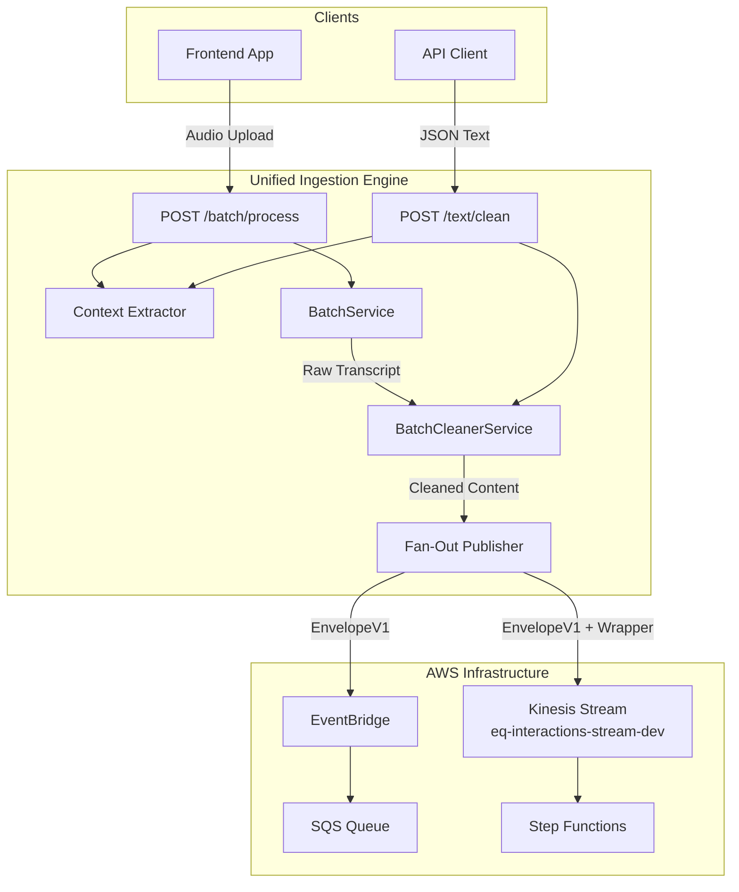

# Design Document: Unified Ingestion Engine Upgrade

## Overview

This design transforms the live-transcription-fastapi service into a Unified Ingestion Engine capable of processing multiple input types (audio, text) and publishing standardized events to AWS Kinesis and SQS/EventBridge via a fan-out architecture.

The upgrade introduces:
1. **EnvelopeV1 Schema** - A standardized event model for all published events
2. **Fan-Out Publisher** - Dual publishing to Kinesis and EventBridge with resilient error handling
3. **Text Ingestion Endpoint** - New `POST /text/clean` route for raw text processing
4. **Enhanced Context Extraction** - Strict header validation with clear error messages

## Architecture



## Components and Interfaces

### 1. EnvelopeV1 Model (`models/envelope.py`)

The standardized event schema for all published events:

```python
from datetime import datetime
from typing import Any, Dict, Optional
from uuid import UUID
from pydantic import BaseModel, Field


class ContentModel(BaseModel):
    """Nested content structure containing the actual text and format."""
    text: str = Field(..., description="The actual content text")
    format: str = Field(
        default="plain",
        description="Content format: 'plain', 'markdown', 'diarized'"
    )


class EnvelopeV1(BaseModel):
    """
    Standardized event envelope for all ecosystem events.
    
    Strict Core: Required fields that must always be present
    Flexible Edges: Optional fields for extensibility
    """
    # Schema Version
    schema_version: str = Field(default="v1", description="Event schema version")
    
    # Strict Core - Identity
    tenant_id: UUID = Field(..., description="Tenant/organization UUID")
    user_id: str = Field(
        ..., 
        description="User identifier (supports Auth0 IDs, type-prefixed IDs)"
    )
    
    # Strict Core - Content
    interaction_type: str = Field(
        ..., 
        description="Type of interaction: 'transcript', 'note', 'document'"
    )
    content: ContentModel = Field(..., description="The actual content payload")
    timestamp: datetime = Field(..., description="Event creation timestamp (UTC)")
    source: str = Field(
        ..., 
        description="Origin of content: 'web-mic', 'upload', 'api', 'import'"
    )
    
    # Flexible Edges - Extensibility
    extras: Dict[str, Any] = Field(
        default_factory=dict,
        description="Flexible metadata for domain-specific extensions"
    )
    
    # Processing Metadata
    interaction_id: Optional[UUID] = Field(
        None, 
        description="Unique identifier for this interaction"
    )
    trace_id: Optional[str] = Field(
        None, 
        description="Distributed tracing identifier"
    )
    
    class Config:
        json_encoders = {
            datetime: lambda v: v.isoformat() + "Z",
            UUID: str
        }
```

### 2. Kinesis Payload Wrapper

When publishing to Kinesis, the EnvelopeV1 is wrapped in a structure that Step Functions can easily route:

```python
class KinesisPayloadWrapper(BaseModel):
    """
    Wrapper structure for Kinesis records.
    
    Duplicates key fields at top level for easy routing
    without parsing the full envelope.
    """
    envelope: Dict[str, Any] = Field(
        ..., 
        description="Complete EnvelopeV1 as JSON object"
    )
    trace_id: Optional[str] = Field(
        None, 
        description="Duplicated for routing"
    )
    tenant_id: str = Field(
        ..., 
        description="Duplicated for partition key visibility"
    )
    schema_version: str = Field(
        default="v1", 
        description="For version-based routing"
    )
```

### 3. Fan-Out Publisher (`services/aws_event_publisher.py`)

Refactored publisher with dual-destination support:

```python
class AWSEventPublisher:
    """
    Fan-out event publisher supporting Kinesis and EventBridge.
    
    Publishing Order:
    1. Attempt Kinesis publish (primary for real-time streaming)
    2. Attempt EventBridge publish (for queue-based consumers)
    3. Log errors but never fail user requests
    """
    
    def __init__(self):
        self.kinesis_client = self._init_kinesis_client()
        self.eventbridge_client = self._init_eventbridge_client()
        self.kinesis_stream = os.getenv(
            "KINESIS_STREAM_NAME", 
            "eq-interactions-stream-dev"
        )
    
    async def publish_envelope(
        self, 
        envelope: EnvelopeV1
    ) -> Dict[str, Optional[str]]:
        """
        Publish envelope to all configured destinations.
        
        Returns:
            Dict with 'kinesis_sequence' and 'eventbridge_id' keys
            (None if publish failed for that destination)
        """
        results = {
            "kinesis_sequence": None,
            "eventbridge_id": None
        }
        
        # 1. Publish to Kinesis
        results["kinesis_sequence"] = await self._publish_to_kinesis(envelope)
        
        # 2. Publish to EventBridge
        results["eventbridge_id"] = await self._publish_to_eventbridge(envelope)
        
        return results
    
    async def _publish_to_kinesis(
        self, 
        envelope: EnvelopeV1
    ) -> Optional[str]:
        """Publish wrapped envelope to Kinesis stream."""
        if not self.kinesis_client:
            logger.warning("Kinesis client not initialized, skipping")
            return None
        
        try:
            # Build wrapper payload
            wrapper = {
                "envelope": envelope.model_dump(mode="json"),
                "trace_id": envelope.trace_id,
                "tenant_id": str(envelope.tenant_id),
                "schema_version": envelope.schema_version
            }
            
            # Partition by tenant for ordering
            partition_key = str(envelope.tenant_id)
            
            response = self.kinesis_client.put_record(
                StreamName=self.kinesis_stream,
                Data=json.dumps(wrapper).encode("utf-8"),
                PartitionKey=partition_key
            )
            
            sequence_number = response["SequenceNumber"]
            logger.info(
                f"Kinesis publish success: "
                f"interaction_id={envelope.interaction_id}, "
                f"sequence={sequence_number}"
            )
            return sequence_number
            
        except Exception as e:
            logger.error(
                f"Kinesis publish failed: "
                f"interaction_id={envelope.interaction_id}, "
                f"tenant_id={envelope.tenant_id}, "
                f"error={type(e).__name__}: {str(e)}",
                exc_info=True
            )
            return None
```

### 4. Enhanced Context Extractor (`utils/context_utils.py`)

Updated to enforce required headers with validation:

```python
from fastapi import HTTPException

def get_validated_context(request: Request) -> RequestContext:
    """
    Extract and validate context from request headers.
    
    Raises:
        HTTPException: 400 if required headers missing or invalid
    """
    # Validate X-Tenant-ID (required, must be UUID)
    tenant_id = request.headers.get("X-Tenant-ID")
    if not tenant_id:
        raise HTTPException(
            status_code=400,
            detail="X-Tenant-ID header is required"
        )
    if not _is_valid_uuid(tenant_id):
        raise HTTPException(
            status_code=400,
            detail="X-Tenant-ID must be a valid UUID"
        )
    
    # Validate X-User-ID (required, non-empty string)
    user_id = request.headers.get("X-User-ID")
    if not user_id or not user_id.strip():
        raise HTTPException(
            status_code=400,
            detail="X-User-ID header is required"
        )
    
    # X-Trace-Id (optional, generate if not provided)
    trace_id = request.headers.get("X-Trace-Id")
    if trace_id and not _is_valid_uuid(trace_id):
        raise HTTPException(
            status_code=400,
            detail="X-Trace-Id must be a valid UUID if provided"
        )
    if not trace_id:
        trace_id = str(uuid.uuid4())
    
    interaction_id = str(uuid.uuid4())
    
    return RequestContext(
        tenant_id=tenant_id,
        user_id=user_id,
        account_id=request.headers.get("X-Account-ID"),
        interaction_id=interaction_id,
        trace_id=trace_id
    )
```

### 5. Text Cleaning Endpoint (`routers/text.py`)

New router for raw text ingestion:

```python
from pydantic import BaseModel, Field
from typing import Any, Dict, Optional


class TextCleanRequest(BaseModel):
    """Request body for text cleaning endpoint."""
    text: str = Field(..., min_length=1, description="Raw text to clean")
    metadata: Optional[Dict[str, Any]] = Field(
        default=None,
        description="Optional metadata to include in extras"
    )
    source: str = Field(
        default="api",
        description="Content source identifier"
    )


class TextCleanResponse(BaseModel):
    """Response from text cleaning endpoint."""
    raw_text: str
    cleaned_text: str
    interaction_id: str


@router.post("/clean", response_model=TextCleanResponse)
async def clean_text(
    body: TextCleanRequest,
    request: Request
):
    """
    Clean raw text and publish to ecosystem.
    
    Reuses BatchCleanerService for consistent cleaning logic.
    Publishes EnvelopeV1 with interaction_type="note".
    """
    context = get_validated_context(request)
    
    # Clean text using existing service
    cleaner = BatchCleanerService()
    cleaned_text = await cleaner.clean_transcript(body.text)
    
    # Build and publish envelope
    envelope = EnvelopeV1(
        tenant_id=UUID(context.tenant_id),
        user_id=context.user_id,
        interaction_type="note",
        content=ContentModel(text=cleaned_text, format="plain"),
        timestamp=datetime.utcnow(),
        source=body.source,
        extras=body.metadata or {},
        interaction_id=UUID(context.interaction_id),
        trace_id=context.trace_id
    )
    
    publisher = AWSEventPublisher()
    await publisher.publish_envelope(envelope)
    
    return TextCleanResponse(
        raw_text=body.text,
        cleaned_text=cleaned_text,
        interaction_id=context.interaction_id
    )
```

## Data Models

### Request Context (Updated)

```python
@dataclass
class RequestContext:
    """Extended context with trace_id support."""
    tenant_id: str      # UUID string
    user_id: str        # Flexible string (Auth0, prefixed, etc.)
    account_id: Optional[str]
    interaction_id: str # UUID string
    trace_id: str       # UUID string for distributed tracing
```

### API Request/Response Models

```python
# Text Cleaning
class TextCleanRequest(BaseModel):
    text: str
    metadata: Optional[Dict[str, Any]] = None
    source: str = "api"

class TextCleanResponse(BaseModel):
    raw_text: str
    cleaned_text: str
    interaction_id: str

# Batch Processing (updated response)
class BatchProcessResponse(BaseModel):
    raw_transcript: str
    cleaned_transcript: str
    interaction_id: str
```


## Correctness Properties

*A property is a characteristic or behavior that should hold true across all valid executions of a system—essentially, a formal statement about what the system should do. Properties serve as the bridge between human-readable specifications and machine-verifiable correctness guarantees.*

Based on the prework analysis, the following properties have been identified for property-based testing:

### Property 1: Tenant ID UUID Validation

*For any* string value provided as `X-Tenant-ID` header, the context extractor SHALL accept it if and only if it is a valid UUID v4 format, and SHALL reject with HTTP 400 otherwise.

**Validates: Requirements 1.1, 1.3, 8.1, 8.6**

### Property 2: User ID Required Validation

*For any* request to protected endpoints, the context extractor SHALL accept the `X-User-ID` header if and only if it is a non-empty string (after trimming whitespace), and SHALL reject with HTTP 400 otherwise.

**Validates: Requirements 1.2, 1.4, 8.2, 8.5**

### Property 3: Trace ID Generation and Preservation

*For any* request, if `X-Trace-Id` header is provided and is a valid UUID, the resulting context SHALL contain that exact trace_id; if not provided, the context SHALL contain a newly generated valid UUID v4.

**Validates: Requirements 1.5, 1.6, 8.3**

### Property 4: EnvelopeV1 Schema Validation

*For any* valid combination of required fields (tenant_id as UUID, user_id as string, interaction_type as string, content as ContentModel, timestamp as datetime, source as string), an EnvelopeV1 instance SHALL be successfully created with schema_version defaulting to "v1" and extras defaulting to empty dict.

**Validates: Requirements 4.1, 4.2, 4.3, 4.4, 4.5, 4.6, 4.7, 4.8, 4.9, 4.10**

### Property 5: EnvelopeV1 Round-Trip Serialization

*For any* valid EnvelopeV1 instance, serializing to JSON and then deserializing back SHALL produce an EnvelopeV1 instance that is equivalent to the original (all field values match).

**Validates: Requirements 4.11**

### Property 6: Kinesis Wrapper Structure

*For any* EnvelopeV1 being published to Kinesis, the wrapper payload SHALL contain: (a) `envelope` key with complete EnvelopeV1 JSON, (b) `trace_id` duplicated at top level, (c) `tenant_id` as string at top level, (d) `schema_version` at top level.

**Validates: Requirements 5.2, 6.1, 6.2, 6.3, 6.4, 6.5**

### Property 7: Response Schema Completeness

*For any* successful processing request (batch or text), the response JSON SHALL contain all required fields: for batch (`raw_transcript`, `cleaned_transcript`, `interaction_id`), for text (`raw_text`, `cleaned_text`, `interaction_id`).

**Validates: Requirements 2.3, 3.4**

### Property 8: Interaction Type Assignment

*For any* EnvelopeV1 published from the batch endpoint, `interaction_type` SHALL be "transcript"; *for any* EnvelopeV1 published from the text endpoint, `interaction_type` SHALL be "note".

**Validates: Requirements 2.4, 3.5**

### Property 9: Whitespace Text Rejection

*For any* string composed entirely of whitespace characters (spaces, tabs, newlines), submitting it as the `text` field to `/text/clean` SHALL result in HTTP 400 rejection.

**Validates: Requirements 3.3**

### Property 10: Partition Key Derivation

*For any* EnvelopeV1 with a tenant_id, the Kinesis partition key used for publishing SHALL equal `str(envelope.tenant_id)`.

**Validates: Requirements 5.3**

## Error Handling

### Context Extraction Errors

| Error Condition | HTTP Status | Error Message |
|----------------|-------------|---------------|
| Missing X-Tenant-ID | 400 | "X-Tenant-ID header is required" |
| Invalid X-Tenant-ID format | 400 | "X-Tenant-ID must be a valid UUID" |
| Missing X-User-ID | 400 | "X-User-ID header is required" |
| Empty X-User-ID | 400 | "X-User-ID header is required" |
| Invalid X-Trace-Id format | 400 | "X-Trace-Id must be a valid UUID if provided" |

### Text Cleaning Errors

| Error Condition | HTTP Status | Error Message |
|----------------|-------------|---------------|
| Empty text field | 400 | "text field is required and cannot be empty" |
| Whitespace-only text | 400 | "text field cannot contain only whitespace" |
| Cleaning service failure | 200 | Returns original text (graceful degradation) |

### Publishing Errors (Non-Fatal)

All publishing errors are logged but do not fail user requests:

```python
# Kinesis failure handling
try:
    await self._publish_to_kinesis(envelope)
except Exception as e:
    logger.error(
        f"Kinesis publish failed: "
        f"interaction_id={envelope.interaction_id}, "
        f"tenant_id={envelope.tenant_id}, "
        f"error={type(e).__name__}: {str(e)}"
    )
    # Continue to EventBridge attempt

# EventBridge failure handling  
try:
    await self._publish_to_eventbridge(envelope)
except Exception as e:
    logger.error(
        f"EventBridge publish failed: "
        f"interaction_id={envelope.interaction_id}, "
        f"tenant_id={envelope.tenant_id}, "
        f"error={type(e).__name__}: {str(e)}"
    )
    # Return success to user anyway
```

### Client Initialization Errors

```python
def _init_kinesis_client(self):
    try:
        return boto3.client("kinesis", region_name=self.region)
    except NoCredentialsError:
        logger.warning(
            "AWS credentials not found. Kinesis publishing disabled."
        )
        return None
```

## Testing Strategy

### Dual Testing Approach

This feature requires both unit tests and property-based tests:

- **Unit tests**: Verify specific examples, edge cases, and error conditions
- **Property tests**: Verify universal properties across all valid inputs using Hypothesis

### Property-Based Testing Configuration

- **Library**: Hypothesis (Python)
- **Minimum iterations**: 100 per property test
- **Tag format**: `Feature: unified-ingestion-upgrade, Property {number}: {property_text}`

### Test File Organization

```
tests/
├── test_envelope_properties.py      # Properties 4, 5, 6, 10
├── test_context_extraction_properties.py  # Properties 1, 2, 3
├── test_endpoint_properties.py      # Properties 7, 8, 9
└── conftest.py                      # Shared fixtures and generators
```

### Property Test Examples

```python
# Property 5: EnvelopeV1 Round-Trip Serialization
from hypothesis import given, strategies as st
from models.envelope import EnvelopeV1, ContentModel

@given(
    tenant_id=st.uuids(),
    user_id=st.text(min_size=1, max_size=100),
    interaction_type=st.sampled_from(["transcript", "note", "document"]),
    text=st.text(min_size=1),
    source=st.sampled_from(["web-mic", "upload", "api", "import"])
)
def test_envelope_round_trip(tenant_id, user_id, interaction_type, text, source):
    """
    Feature: unified-ingestion-upgrade, Property 5: EnvelopeV1 Round-Trip
    For any valid EnvelopeV1, serialize then deserialize produces equivalent object.
    Validates: Requirements 4.11
    """
    original = EnvelopeV1(
        tenant_id=tenant_id,
        user_id=user_id,
        interaction_type=interaction_type,
        content=ContentModel(text=text, format="plain"),
        timestamp=datetime.utcnow(),
        source=source
    )
    
    # Serialize to JSON
    json_str = original.model_dump_json()
    
    # Deserialize back
    restored = EnvelopeV1.model_validate_json(json_str)
    
    # Verify equivalence
    assert restored.tenant_id == original.tenant_id
    assert restored.user_id == original.user_id
    assert restored.interaction_type == original.interaction_type
    assert restored.content.text == original.content.text
    assert restored.source == original.source
```

### Unit Test Coverage

Unit tests should cover:

1. **Specific examples** demonstrating correct behavior
2. **Edge cases**: Empty strings, special characters, boundary values
3. **Error conditions**: Missing headers, invalid formats, service failures
4. **Integration points**: Mocked AWS client interactions

### Mocking Strategy

```python
# Mock Kinesis client for unit tests
@pytest.fixture
def mock_kinesis_client():
    mock = MagicMock()
    mock.put_record.return_value = {"SequenceNumber": "12345"}
    return mock

# Mock EventBridge client
@pytest.fixture  
def mock_eventbridge_client():
    mock = MagicMock()
    mock.put_events.return_value = {
        "FailedEntryCount": 0,
        "Entries": [{"EventId": "event-123"}]
    }
    return mock
```

### Coverage Requirements

- Minimum 80% code coverage for new services
- 100% coverage for EnvelopeV1 model and context extraction
- All 10 correctness properties must have passing property tests
